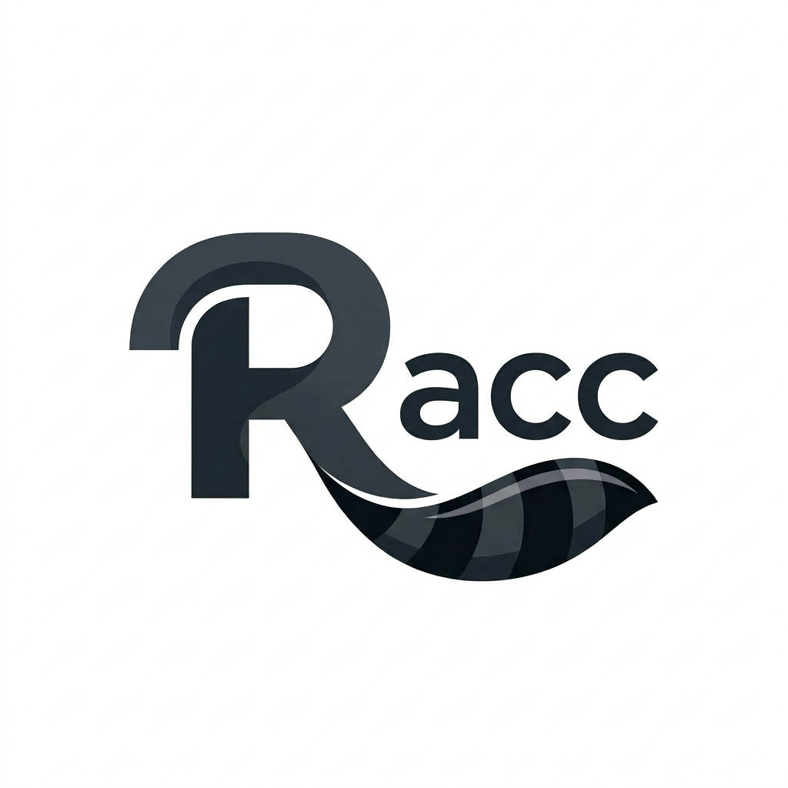
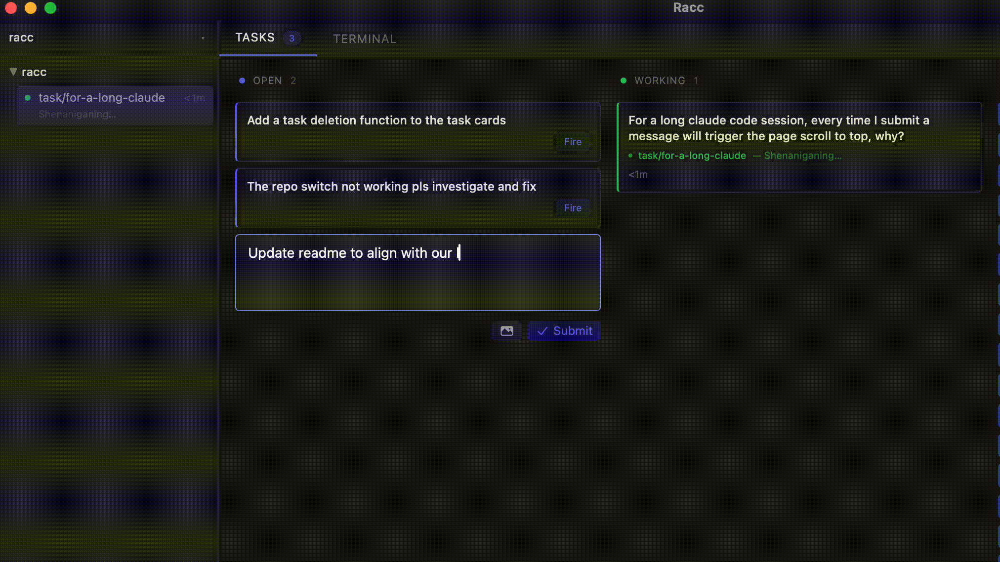

<p align="center">
  
</p>

<h1 align="center">Racc</h1>

<p align="center">
  A desktop control plane for orchestrating AI coding agents.
</p>

<p align="center">
  <a href="https://github.com/liu1700/racc/blob/main/LICENSE"></a>
  <a href="https://github.com/liu1700/racc/releases"></a>
</p>

---

<p align="center">
  
</p>

## What is Racc?

Racc is a desktop app that lets you run multiple AI coding agents in parallel — each in its own terminal, its own git worktree, fully isolated. It's not a code editor. It's the control plane you've been missing.

Currently supports **Claude Code**, with **Codex** support planned.

## Features

- **Multi-agent sessions** — Run multiple agent sessions side by side
- **Agent-agnostic** — Communicates via native PTY, works with any agent that runs in a terminal
- **Git worktree isolation** — Each session gets its own worktree automatically, no conflicts
- **Task board** — Kanban-style board for cognitive offloading and automated agent orchestration
- **Remote servers** — SSH into remote machines and run agents in persistent tmux sessions
- **Server management** — Add servers via SSH config import or manual setup, with connection testing and status tracking
- **Headless server** — Run `racc-server` for browser-based access from any device on your Tailscale network

## Roadmap

| Milestone | Description | Status |
|-----------|-------------|--------|
| **v0.1 — MVP** | Multi-session dashboard, task board, git worktree isolation, file viewer | Done |
| **v0.2 — Remote & Multi-Agent** | Remote server sessions via SSH/tmux, Codex support, Docker sandbox | In progress |
| **v0.3** | TBD | — |

## Download

Grab the latest `.dmg` from the [Releases](https://github.com/liu1700/racc/releases) page.

## Build from Source

**Prerequisites:** [Rust](https://www.rust-lang.org/tools/install) (stable) | [Bun](https://bun.sh/) (v1.0+) | [Git](https://git-scm.com/) | [Tauri 2.x prerequisites](https://v2.tauri.app/start/prerequisites/)

**Note:** If you don't have Rust installed, run:
```bash
curl --proto '=https' --tlsv1.2 -sSf https://sh.rustup.rs | sh
source "$HOME/.cargo/env"
```

```bash
git clone https://github.com/liu1700/racc.git
cd racc
bun install

# Desktop app
bun tauri dev

# Headless server (browser access)
bun run build
cd src-tauri && cargo run --bin racc-server
# Open http://localhost:9399 or http://<tailscale-host>:9399
```

## Architecture

Three-crate Rust workspace: `racc-core` (business logic), `racc-server` (headless axum binary), and the Tauri desktop app (thin wrappers). The React frontend auto-detects its environment — Tauri IPC in the desktop app, WebSocket in the browser. Sessions use native PTY locally or SSH/tmux for remote servers.

See the [wiki](https://github.com/liu1700/racc/wiki) for detailed design docs, including [Technical Architecture](https://github.com/liu1700/racc/wiki/Technical-Architecture) and [Cognitive Design Research](https://github.com/liu1700/racc/wiki/Cognitive-Design-Research).

## Why "Racc"?

Short for **raccoon** — clever, adorable, with nimble little hands. But be careful — they can be surprisingly brutal sometimes.

<p align="center">
  
</p>

## Contributing

We welcome contributions! See [CONTRIBUTING.md](CONTRIBUTING.md) for setup instructions and guidelines.

## License

[MIT](LICENSE)
